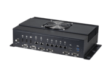
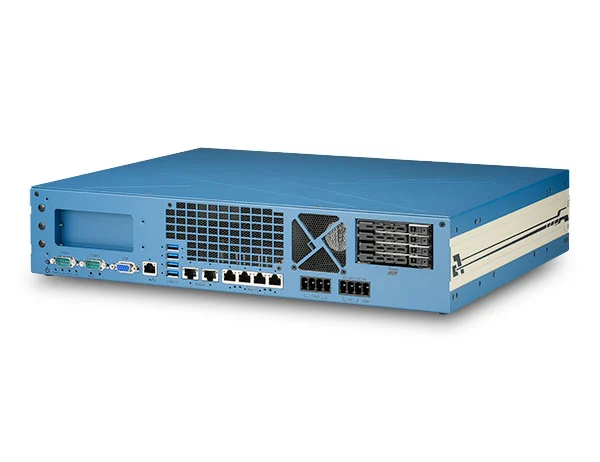
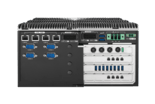

# X86-based ECUs

The page lists the X86-bsaed ECUs being tested for LSA, which can meet the computation capacity requirement of LSA but does not overprovision the resource requirements. 

Another page on [Autoware Document](https://autowarefoundation.github.io/autoware-documentation/main/reference-hw/ad-computers/) lists the ECUs being for other use scenarios. 

(Candidates of the ECUS to be used by the LSA)

## **ADLINK In-Vehicle Computers**

ADLINK solutions which is used for autonomous driving and tested by one or more community members are listed below:

  <!-- cspell: ignore Altra BLUEBOX Grms Quadro Vecow vecow -->

| Supported Products List         | CPU                                    | GPU                      | RAM, Interfaces                                                                                    | Environmental                                                                                  | Autoware Tested (Y/N) |
| ------------------------------- | -------------------------------------- | ------------------------ | -------------------------------------------------------------------------------------------------- | ---------------------------------------------------------------------------------------------- | --------------------- |
| ADM-AL30                        | Intel® 13/12th Gen Core™ I processor | Nvidia RTX 4000 SFF Ada  | 128GB RAM, Serial, USB, Automotive Ethernet (Base-T1), 10G Ethernet, CAN 2.0/ CAN-FD, M.2/SATA SSD | 9~36 VDC, E-Mark, 7637-2, IEC 60068-2-64: Operating: 5Grms, random, 5-500Hz, 3 axes (with SSD) | Y                     |
| AVA-3510                        | Intel® Xeon® E-2278GE                | Dual MXM RTX 5000        | 64GB RAM,CAN, USB, 10G Ethernet, DIO, Hot-Swap SSD, USIM                                           | 9~36 VDC, MIL-STD-810H,ISO 7637-2                                                              | Y                     |

Link to company website is [here.](https://www.adlinktech.com/en/Connected-Autonomous-Vehicle-Solutions)

## **AdvanTech In-Vehicle Computers**

Advantech's autonomous driving and robotic computers are of compact size, with GMSL camera and other sensor data available at ROS level.

| Supported Products List | CPU | GPU | RAM, Interfaces | Environmental | Autoware Tested (Y/N) |
| --- | --- | --- | --- | --- |--- |
| **AFE-R760** (system, but the board  AFE-R360 is also avaialbe)|Intel® Core™ Ultra 7/5 Processors|(Optional) MXM-type RTX A2000/A4500/5000Ada| <ul><li>4 GMSL2 cameras</li><li>Dual Channel DDR5-5600, up to 96GB</li><li>3 x LAN up to 2.5GbE</li><li>4 x RS-232/422/485</li><li>2 x USB-C & 2 USB-A  (10Gbps)</li><li>2 x CAN-FD</li></ul>|<ul><li>Operating Temperature: -20 ~ 60° C with 0.7m/s air flow</li><li>Vibration During Operation: 3 Grms, IEC 60068-2-64, random, 5 ~ 500 Hz, 1 hr/axis.</li><li>Shock During Operation 30 G, IEC 60068-2-27, half sine, 11 ms duration</li><li>EMC: Heavy industrial certificates, CE/FCC Class B, UKCA, CCC, BSMI</li></ul>|Y|
| **AFE-R750-X0A1U** (AGX Orin 32GB/64GB system, but the board  ASR-A701 is also avaialbe) | 8/12-core NVIDIA Arm® Cortex A78AE v8.2 | 1792/2048-core NVIDIA Ampere GPU with 56/64 Tensor Cores | <ul><li>8 x GMSL2 cameras</li><li>BOSCH BMI088 IMU</li><li>Xsens MTi3 IMU (Optional)</li><li>32/64GB 256-bit LPDDR5 DRAM</li><li> 4 x 2.5GbE, 4 x USB 3.2 Type A, 2 x isolated CANFD, 16bit isolated DIO, 2 x RS232/422/485</li> </ul> | <ul><li>20~28V DC</li> <li>-10 ~ 60°C/50°C with 0.7 m/s air flow for 32GB/64GB</li></ul> |Y|

Link to company website is [here.](https://campaign.advantech.online/en/AMR-Robotic-Solutions/)

## **Neousys In-Vehicle Computers**

Neousys solutions which is used for autonomous driving and tested by one or more community members are listed below:

| Supported Products List | CPU                          | GPU                                | RAM, Interfaces                                                                    | Environmental                                                | Autoware Tested (Y/N) |
| ----------------------- | ---------------------------- | ---------------------------------- | ---------------------------------------------------------------------------------- | ------------------------------------------------------------ | --------------------- |
| 8805-GC                 | AMD® EPYC™ 7003            | NVIDIA® RTX A6000/ A4500          | 512GB CAN, USB, Ethernet, Serial, Easy-Swap SSD                                    | 8-48 Volt, Vibration:MIL-STD810G, Method 514.6, Category 4   | Y                     |
| 10208-GC                | Intel® 13th/12th-Gen Core™ | Dual 350W NVIDIA® RTX GPU         | 64GB CAN, USB, Ethernet, Serial, M2 NVMe SSD                                       | 8~48 Volt, Vibration: MIL-STD-810H, Method 514.8, Category 4 | Y                     |
| 9160-GC                 | Intel® 13th/12th-Gen Core™ | NVIDIA® RTX series up to 130W TDP | 64GB CAN, USB, Ethernet, PoE, Serial, two 2.5" SATA HDD/SSD with RAID, M2 NVMe SSD | 8~48, Vibration: Volt,MIL-STD-810G, Method 514.6, Category 4 | -                     |

Link to company website is [here.](https://www.neousys-tech.com/en/product/product-lines/edge-ai-gpu-computing)

## **Crystal Rugged In-Vehicle Computers**

Crystal Rugged solutions which is used for autonomous driving and tested by one or more community members are listed below:

| Supported Products List | CPU                                                 | GPU                      | RAM, Interfaces                                          | Environmental                                                                 | Autoware Tested (Y/N) |
| ----------------------- | --------------------------------------------------- | ------------------------ | -------------------------------------------------------- | ----------------------------------------------------------------------------- | --------------------- |
| AVC 0161-AC             | Intel® Xeon® Scalable                             | Dual GPU RTX Series      | 2TB RAM,CAN, USB, Ethernet, Serial, Hot-Swap SSD         | 10-32 VoltVibration:2 G RMS 10-1000 Hz, 3 axes                                | -                     |
| AVC0403                 | Intel® Xeon® Scalable or AMD EPYC™               | Optional (5 GPU)         | 2TB RAM, CAN, USB, Ethernet, Serial, Hot-Swap SSD        | 10-32 Volt, Vibration: 2 G RMS 10-1000 Hz, 3 axes                             | -                     |
| AVC1322                 | Intel® Xeon® D-1718T or Gen 12/13 Core™ i3/i5/i7 | NVIDIA® Jetson AGX Orin | 128 GB DDR4 RAM, USB, Ethernet, Serial, SATA 2.5” SSD    | 10-36 Volt, Vibration: 5.5g, 5-2,000Hz, 60 min/axis, 3 axis                   | -                     |
| AVC1753                 | 10th Generation Intel® Core™ and Xeon®           | Optional (1 GPU)         | 128 GB DDR4 RAM, USB, Ethernet, NVMe U.2 SSD/ 3 SATA SSD | 8-36 VDC/ 120-240VAC 50/60Hz, Vibration: 5.5g, 5-2,000Hz, 60 min/axis, 3 axis | -                     |

Link to company website is [here.](https://www.crystalrugged.com/products/ai-autonomous-vehicle-technology/)

## **Vecow In-Vehicle Computers**

Vecow solutions which is used for autonomous driving and tested by one or more community members are listed below:

| Supported Products List | CPU                          | GPU                                    | RAM, Interfaces                                                   | Environmental                                                | Autoware Tested (Y/N) |
| ----------------------- | ---------------------------- | -------------------------------------- | ----------------------------------------------------------------- | ------------------------------------------------------------ | --------------------- |
| ECX-3800 PEG            | Intel® 13th/12th-Gen Core™ | 200W power of NVIDIA® or AMD graphics | 64GB RAM, CAN, USB, Ethernet, PoE, Serial, M.2/SATA SSD, SIM Card | 12-50 Volt, Vibration:MIL-STD810G, Procedure I, 20°C to 45°C | -                     |
| IVX-1000                | Intel® 13th/12th-Gen Core™ | NVIDIA Quadro® MXM Graphics           | 64GB RAM, Ethernet, PoE, Serial, M.2/SATA/mSATA SSD, SIM Card     | 16-160 Volt, Vibration: IEC 61373 : 2010, 40°C to 85°C       | -                     |

Link to company website is [here.](https://www.vecow.com/dispPageBox/vecow/VecowHp.aspx?ddsPageID=VECOW_EN)

