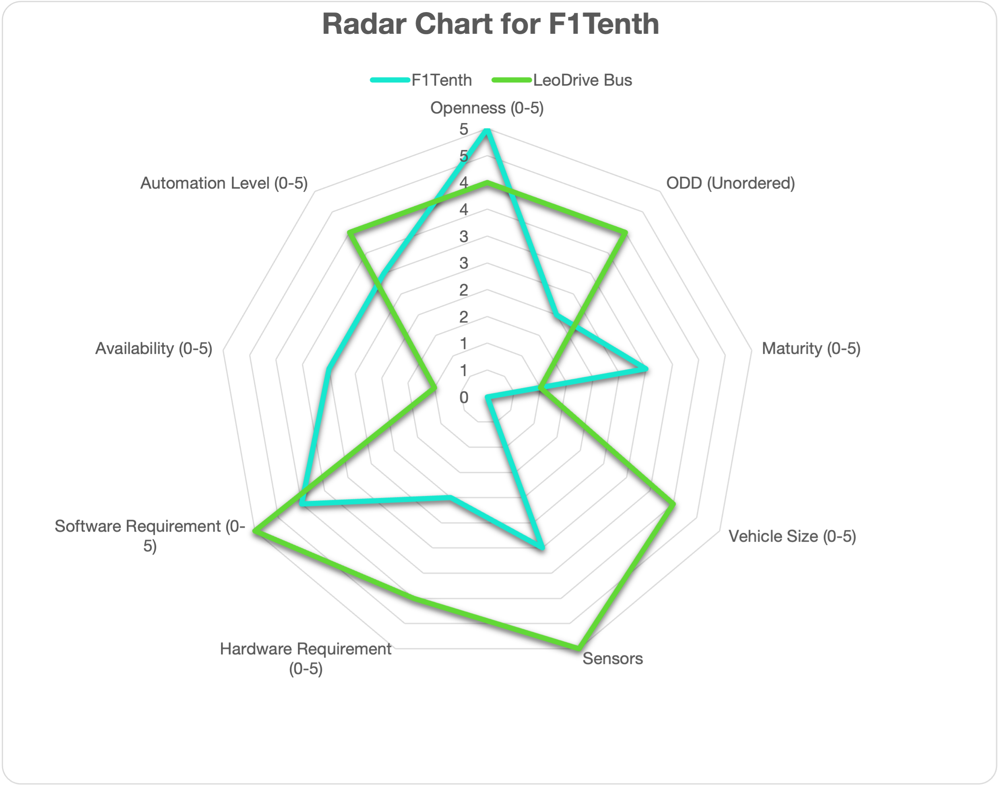
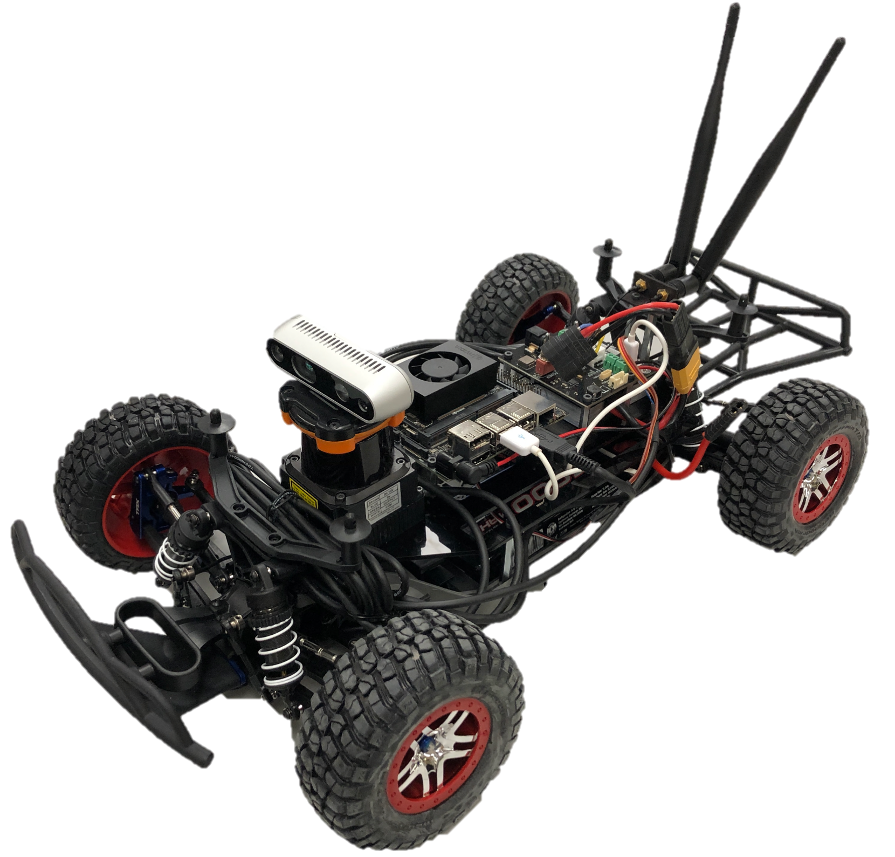

# Overview: 

This document elaborates the hardware and software configurations for using Autoware for autonomous driving. Hence, it will serve as a guideline to select hardware and software components to build autonomous vehicles. However, this document is NOT prepared as neither step-by-step instructions nor Q&A books, which will be provided as a reference link if available. 

# Design Overview: 

# Who should read: 
One is interested in building your autonomous racing cars or low-cost platforms to learn Autoware, and looks for the place to start with. 

# References and Resources: 
- Complete F1Tenth documents: [link](https://f1tenth.readthedocs.io/en/foxy_test/getting_started/intro.html)
- Step-By-Step Instructions to deploy Autoware on F1Tenth: [link](https://f1tenth.readthedocs.io/en/foxy_test/autoware/intro.html)

# Contributors: [complete list](https://f1tenth.readthedocs.io/en/foxy_test/support/acknowledgment.html#contributors)
## F1TENTH Core Developers
- Hongrui (Billy) Zheng
- Johannes Betz
## Contributors
- Matthew O’Kelly
- Kim Luong
- Haoru Xue
- Joshua Whitley
- F1TENTH Lehigh and Rosa Zheng
- F1TENTH UCSD and Jack Silberman
- Jim Benson

# Community Outreach
- Rahul Mangharam
- F1TENTH Clemson and Venkat Krovi
- Jaroslav Klapálek

# Targeted Use Cases

| Use Cases: | Education | Racing | PoC | Open AD Kit | Commercial Services/Production |
|:--------: | :--------:| :---------: | :---------: |:---------: | :---------: |
|F1Tenth | <input type="checkbox" checked />  | <input type="checkbox" checked />  | <input type="checkbox" disabled  />  | <input type="checkbox" disabled  />  | <input type="checkbox" disabled  />  | 

# ODD

| ODD | Cargo | Bus | RoboTaxi | Low Speed (Utility) Vehicle | Delivery Robot |
|:--------: | :--------:| :---------: | :---------: |:---------: | :---------: |
|F1Tenth | <input type="checkbox" disabled  />  | <input type="checkbox" disabled />  | <input type="checkbox" disabled  />  | <input type="checkbox" disabled  />  | <input type="checkbox" disabled  />  | 

# Automation Level:
| Automation Level | 0 | 1 | 2 | 3 | 4 | 5 |
|:--------: | :--------:| :---------: | :---------: |:---------: | :---------: | :---------: |
|F1Tenth | <input type="checkbox" checked  />  |  <input type="checkbox" checked  />  | <input type="checkbox" checked />  | <input type="checkbox" disabled  />  | <input type="checkbox" disabled  />  | <input type="checkbox" disabled  />  | 

# System Architecture

F1Tenth can be used for racing and education purpose. The simplest use case is to avoid colliding into the obstacle on a racing track. Meanwhile, one can also develop the SLAM algorithm to build the map on the fly and finishes the loop in short time. 

![[f1tenth_NX.webp]]

# Hardware Configuration
## Chassis:
-  Traxxas Slash 4x4 Premium: [link to purchase](https://www.amainhobbies.com/traxxas-slash-4x4-ultimate-rtr-4wd-short-course-truck-orange-tra68077-4-orng/p858530)
- VESC Speed Controllers: # VESC 6 MK III

## Sensors:
- Lidar: choose one
	- Hokuyo UTM-30LX
	- Hokuyo 10LX
- Camera (optional):
	- ZED 2
	- Intel Real Sense

## Computing Platforms:
- NVIDIA Jetson Xavier NX
- USB Hub (4 ports)
- (DEPRECATED) NVIDIA Jetson TX2

# Software Configuration 
- Software on the car:
	- Operating System: Linux 20.04
	- ROS: [ROS2 galactic](https://docs.ros.org/en/galactic/Installation/Ubuntu-Install-Debians.html)
	- GPU Driver: nVidia: JetPack 5.1.1 (rev. 1)
	- [Autoware](https://github.com/autowarefoundation/autoware.git)
	- SLAM Toolbox to create and edit map: ros-galactic-slam-toolbox
- Tools: 
	- Simulator: [f1tenth simulator](https://f1tenth.readthedocs.io/en/foxy_test/going_forward/simulator/index.html)
	- VESC Tool for motor control: [link](https://vesc-project.com/vesc_tool)
	- Version Control tool: [vcstool](https://github.com/dirk-thomas/vcstool)
